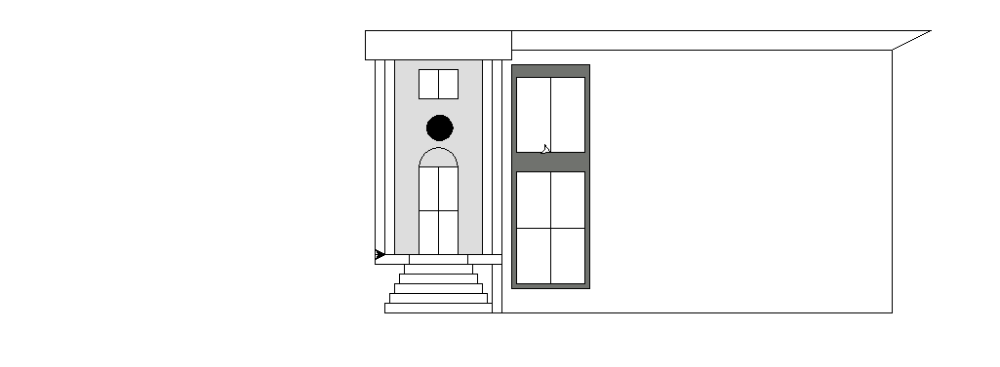
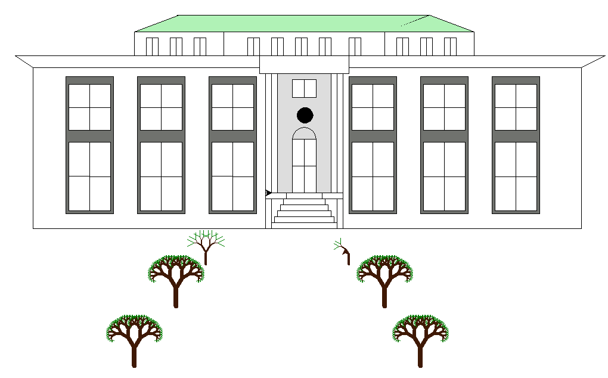
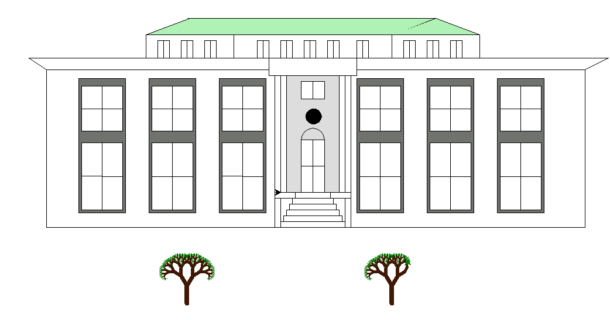
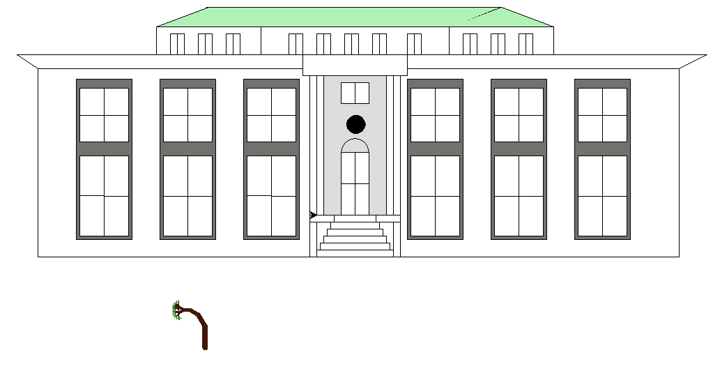
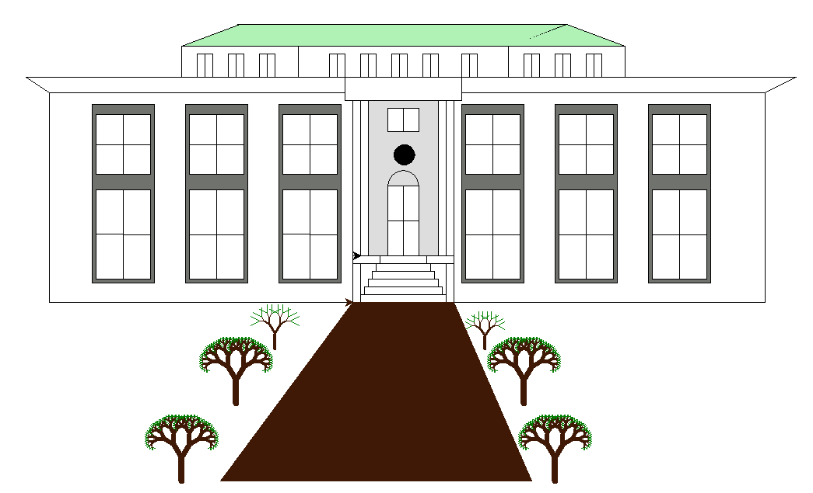

## Projet 1 POO2 GL 2021
<h1>MDK</h1>
<body>
        

        

            <MARQUEE scrollamount="6" width="800" height="300" behavior="alternate">
                
                
                
                
                
                
                
                
            </MARQUEE>
           
        

    

                        
                        <a href="https://github.com/ghost8399/Projet-1-POO-2-GL-2021/tree/main/pdf"><h3> Voir mes documentations</h3></a> 
                        <a href="https://github.com/ghost8399/Projet-1-POO-2-GL-2021/tree/main/code_src"><h3> Code source du projet</h3></a>
      
    </body>
